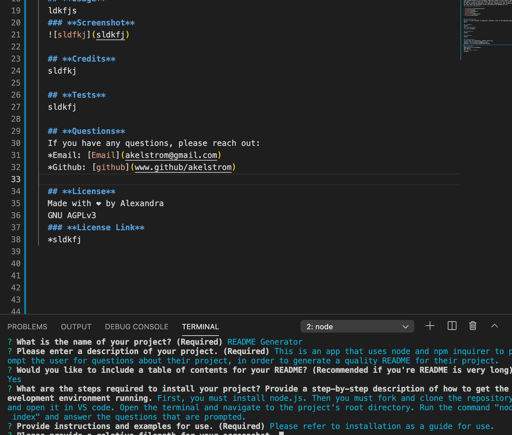

# **README Generator**
  
  ## **Description**
  This is an app that uses node and npm inquirer to prompt the user for questions about their project, in order to generate a quality README for their project.
  ## **Table of Contents**

  * [Installation](#installation)
  * [Usage](#usage)
  * [Credits](#credits)
  * [Tests](#tests)
  * [Questions](#questions)
  * [License](#license)
  
  
  ## **Installation**
  First, you must install node.js. Then you must fork and clone the repository and open it in VS code. Open the terminal and navigate to the project's root directory. Run the command "node index" and answer the questions that are prompted. 

  ## **Usage**
  Please refer to installation as a guide for use.
  ### **Screenshot**
  

  ## **Credits**
  Thank you to my tutor, who assisted with my understanding of node and npm. 

  ## **Tests**
  There are no tests for this application at the moment.

  ## **Questions**
  If you have any questions, please reach out:
  * Email: [Email](akelstrom@gmail.com)
  * Github: [github](www.github/akelstrom)
  
  ## **License**
  Made with ❤️ by Alexandra
  MIT License
  ### **License Link**
  * https://choosealicense.com/licenses/mit/

 
