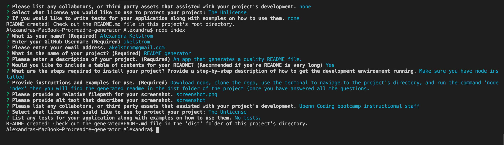

# **My Project Title**
  
  ## **Description**
  This project 
  ## **Table of Contents**

  * [Installation](#installation)
  * [Usage](#usage)
  * [Credits](#credits)
  * [Tests](#tests)
  * [Questions](#questions)
  * [License](#license)
  
  
  ## **Installation**
  install node

  ## **Usage**
  clone repo and run the command node index
  #### **Screenshot**
  

  ## **Credits**
  thank you to my tutor

  ## **Tests**
  no tests

  ## **Questions**
  If you have any questions, feel free to reach out by email or GitHub:  
  * Email: [Email](mailto:akelstrom@gmail.com)
  * GitHub: [github](www.github.com/akelstrom)
  
  ## **License**
  Made with ❤️ by Alexandra  
  MIT License
  #### **License Link**
  * https://choosealicense.com/licenses/mit/

 
